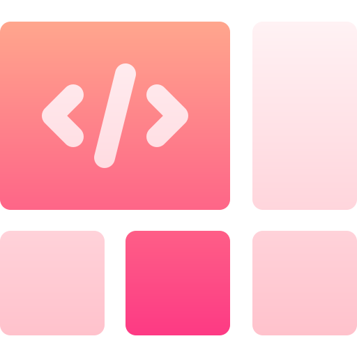
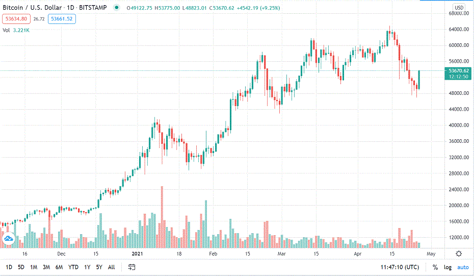

<!--
Hey, thanks for using the awesome-readme-template template.
If you have any enhancements, then fork this project and create a pull request
or just open an issue with the label "enhancement".

Don't forget to give this project a star for additional support ;)
Maybe you can mention me or this repo in the acknowledgements too
-->
<div align="center">

  
  <h1>README for our Project</h1>

  <p>
    An awesome README template for your projects!
  </p>

<!-- Badges -->
<p>
  <a href="https://github.com/ABDULALI3468/crypto-capstone/graphs/contributors">
    
  </a>
  <a href="">
    
  </a>
  <a href="https://github.com/ABDULALI3468/crypto-capstone/network/members">
    
  </a>
  <a href="https://github.com/ABDULALI3468/crypto-capstone/stargazers">
    
  </a>
  <a href="https://github.com/ABDULALI3468/crypto-capstone/issues/">
    
  </a>
  <a href="https://github.com/ABDULALI3468/crypto-capstone/blob/master/LICENSE">
    
  </a>
</p>

<h4>
    <a href="https://tokenworld.netlify.app/">View Demo</a>
  <span> · </span>
    <a href="https://github.com/ABDULALI3468/crypto-capstone/issues/">Report Bug</a>
  <span> · </span>
    <a href="https://github.com/ABDULALI3468/crypto-capstone/issues/">Request Feature</a>
  </h4>
</div>

<br />

<!-- Table of Contents -->

# Table of Contents

- [About the Project](#star2-about-the-project)
  - [Screenshots](#camera-screenshots)
  - [Tech Stack](#space_invader-tech-stack)
  - [Features](#dart-features)
- [Getting Started](#toolbox-getting-started)
  - [Prerequisites](#bangbang-prerequisites)
  - [Run Locally](#running-run-locally)
  - [Deployment](#triangular_flag_on_post-deployment)
- [Usage](#eyes-usage)
- [Contributing](#wave-contributing)
- [License](#warning-license)
- [Contact](#handshake-contact)
- [Acknowledgements](#gem-acknowledgements)

<!-- About the Project -->

## :star2: About the Project

<!-- Screenshots -->

### :camera: Screenshots

<div align="center" >
  
</div>

<!-- TechStack -->

### :space_invader: Tech Stack

<details>
  <summary>Client</summary>
  <ul>
    <li><a href="https://reactjs.org/">React.js</a></li>
    <li><a href="https://reactjs.org/">REDUX</a></li>
  </ul>
</details>

<details>
  <summary>Testing</summary>
  <ul>
    <li><a href="https://jestjs.io/">JEST</a></li>
  </ul>
</details>

<details>
  <summary>Programming Languages</summary>
  <ul>
    <li><a href="#">JavaScript</a></li>
  </ul>
</details>


<!-- Features -->

### :dart: Features

- Provides latest, accurate data about various crypto currencies
- Shows marketcap, top and low sellings, history of crypto currencies
- Helps giving core advices you should know before taking any step.


<!-- Getting Started -->

## :toolbox: Getting Started

<!-- Prerequisites -->

### :bangbang: Prerequisites

This project uses Npm as package manager

```bash
 npm install --global npm
```

<!-- Run Locally -->

### :running: Run Locally

Clone the project

```bash
  git clone https://github.com/ABDULALI3468/crypto-capstone.git
```

Go to the project directory

```bash
  cd crpyto-capstone
```

Install dependencies

```bash
  npm install
```

Start the server

```bash
  npm start
```

<!-- Deployment -->

### :triangular_flag_on_post: Deployment

To deploy this project run

```bash
  npm deploy
```

<!-- Usage -->

## :eyes: Usage

On the main page one can see list of 50 major Crypto Currencies. Website provides accurate and latest data about them. It will show you everything you need to know. This includes marketcap, top and low sellings, its history and gave you some core advices you should know before taking any step.

<!-- Contributing -->

## :wave: Contributing

<a href="https://github.com/ABDULALI3468/crypto-capstone/graphs/contributors">
  
</a>

Contributions, issues, and feature requests are welcome!

Feel free to check the [issues page](https://github.com/ABDULALI3468/crypto-capstone/issues).

<!-- License -->

## :warning: License

See [LICENSE](./LICENSE) for more information.

<!-- Contact -->

## :handshake: Contact

## Authors

👤 **ABDUL ALI **

> - This is My **GitHub**: 
> - This is My **Linkedin**: [](https://www.linkedin.com/in/abdul-ali-5400bb216/)&nbsp;
> - This is My **Twitter**: [](https://twitter.com/mrabdul_ali)&nbsp;


<!-- Acknowledgments -->

## :gem: Acknowledgements

Use this section to mention useful resources and libraries that you have used in your projects.

- [Nelson Sakwa on Behance.](https://www.behance.net/sakwadesignstudio)
- [Shields.io](https://shields.io/)
- [Awesome README](https://github.com/matiassingers/awesome-readme)
- [Emoji Cheat Sheet](https://github.com/ikatyang/emoji-cheat-sheet/blob/master/README.md#travel--places)
